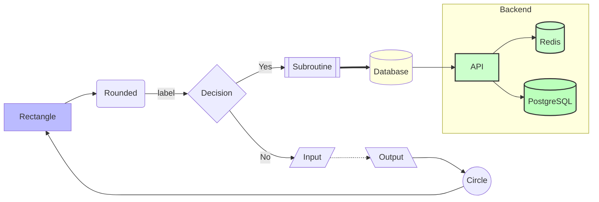

```mermaid
flowchart LR

%% Узлы
A[Rectangle]
B(Rounded)
C((Circle))
D{Decision}
E[/Input/]
F[\Output\]
G[[Subroutine]]
H[(Database)]

%% Связи
A --> B
B -->|label| D
D -->|Yes| G
D -->|No| E

G ==> H
E -.-> F
F --> C
C --> A

%% Подграф
subgraph Backend
    API[API]
    Redis[(Redis)]
    DB[(PostgreSQL)]

    API --> Redis
    API --> DB
end

H --> API

%% Стили
style A fill:#bbf
style H fill:#ffd
style DB fill:#bfb

%% Классы
classDef server fill:#cfc,stroke:#333,stroke-width:2px;
class API,Redis,DB server;
```

````

```mermaid
flowchart LR

%% Узлы
A[Rectangle]
B(Rounded)
C((Circle))
D{Decision}
E[/Input/]
F[\Output\]
G[[Subroutine]]
H[(Database)]

%% Связи
A --> B
B -->|label| D
D -->|Yes| G
D -->|No| E

G ==> H
E -.-> F
F --> C
C --> A

%% Подграф
subgraph Backend
    API[API]
    Redis[(Redis)]
    DB[(PostgreSQL)]

    API --> Redis
    API --> DB
end

H --> API

%% Стили
style A fill:#bbf
style H fill:#ffd
style DB fill:#bfb

%% Классы
classDef server fill:#cfc,stroke:#333,stroke-width:2px;
class API,Redis,DB server;
````

```

```
